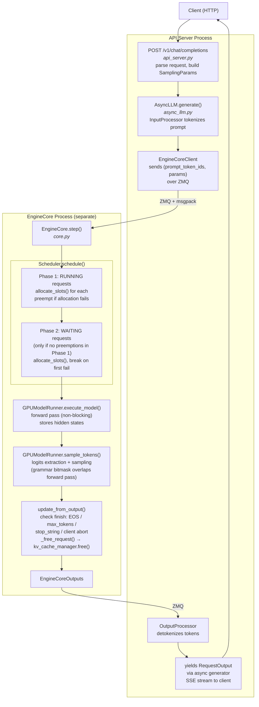
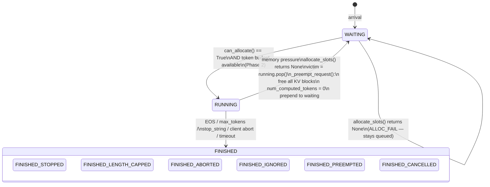

# Week 2 Deliverable: Annotated vLLM V1 Architecture Diagram

Phase A, vLLM Internals
Model: Qwen2.5-3B-Instruct on Tesla T4 (15 GB VRAM)
vLLM version: V1 (no swap path, recompute-only preemption)

---

## Section 1: Request Lifecycle



Key design decisions:

- Process separation: EngineCore runs in a dedicated process, communicating via ZMQ + msgpack. Isolates GPU-bound scheduler loop from async HTTP server.
- Two-phase execution: `execute_model()` and `sample_tokens()` are separate calls. Grammar bitmask computation overlaps with GPU forward pass.
- RUNNING before WAITING: scheduler prioritizes existing work (Phase 1) over new admissions (Phase 2). Not "decode over prefill", a RUNNING request could still be in chunked prefill. Scheduler only tracks `num_computed_tokens` advancing toward `num_tokens`.
- Decode-before-prefill ordering is a tensor layout optimization inside `GPUModelRunner.prepare_inputs()`. The GPU sees one flat batch.

---

## Section 2: Request State Machine (V1)

V1 has no SWAPPED state. Preemption discards KV blocks entirely, requeuing for full re-prefill.



Sub-states while RUNNING:
- `WAITING_FOR_FSM`, grammar/structured output FSM
- `WAITING_FOR_REMOTE_KVS`, KV cache transfer in disaggregated prefill
- `WAITING_FOR_STREAMING_REQ`, streaming request data

Transition details:

- WAITING -> RUNNING (`scheduler.py`, Phase 2): `allocate_slots()` succeeds AND token budget has room. Request receives blocks and enters the next forward pass.

- RUNNING -> FINISHED (`core.py`, `update_from_output()`): EOS, `max_tokens`, stop string, or client abort. Calls `_free_request()` -> `kv_cache_manager.free()`. Blocks returned to pool.

- RUNNING -> WAITING (`scheduler.py`, Phase 1 preemption loop): RUNNING request needs a new block but `allocate_slots()` returns `None`. Scheduler pops lowest-priority request via `self.running.pop()`. `_preempt_request()` frees all victim blocks, resets `num_computed_tokens = 0`, prepends victim to `self.waiting`. Cost: full re-prefill from scratch. All prior decode work discarded.

- WAITING -> WAITING (allocation failed): Phase 2 promotion attempted but `allocate_slots()` returns `None`. Request stays queued. Common steady-state under memory pressure (1,398 ALLOC_FAIL events in collapse experiment).

V0 vs V1: V0 had SWAPPED state with GPU <-> CPU KV cache migration (`swap_in()`/`swap_out()`). V1 removed this. Preemption always means full recompute. Simpler scheduler, more expensive per preemption event.

---

## Section 3: Preemption Cost Annotation

V1 cost model (single path, no swap):

```
Recompute cost = full re-prefill of prompt + re-decode of all previously generated tokens
               = proportional to (prompt_length + tokens_generated_before_preemption)

TTFT for requeued request = queue wait time + re-prefill time
```

No swap path in V1. Every preemption discards all KV blocks and resets `num_computed_tokens = 0`.

### Observed cost, request `9474796f` (preempted 6 times)

| Preemption # | Elapsed | Tokens Lost | Observation |
|---|---|---|---|
| 1 | T+38.0s | 45 | Barely started decode |
| 2 | T+39.5s | 73 | Re-prefilled, evicted 1.5s later |
| 3 | T+53.4s | 403 | Real progress, all discarded |
| 4 | T+60.9s | 411 | Slightly further, evicted again |
| 5 | T+68.1s | 557 | Over half of max_tokens, thrown away |
| 6 | T+72.5s | 667 | Nearly complete output, evicted and restarted |

Total discarded decode work: 2,156 tokens (more than the 1,900 needed to finish). Timed out at 120s without completing.

### Preemption is memory-neutral, compute-wasteful

Preemption frees N blocks from victim. On reschedule, victim consumes at most N blocks. Block pool doesn't shrink. Waste is entirely compute: re-prefill consumes token budget that could advance other requests. Under sustained pressure, the system is overcommitted (32 requests x ~60 blocks = 1,920 needed, 1,034 available). Preemption churns through requests, wasting compute without reducing demand. Bad steady state where work gets thrown away.

### Connection to TTFT cliff

Preemption cost directly produces the TTFT spike in Block 2. At c=14, requests needing 75 prefill blocks must wait for a running request to finish its entire decode, free all 88 blocks, and make room. That wait in WAITING state: 8,735ms max TTFT vs 671ms at c=12.

### Potential mitigation: prefix caching

On re-admission, the KVCacheManager's prefix cache (hash map of computed block contents) can detect still-resident prefix blocks. If blocks haven't been evicted from the hash map, re-prefill skips those tokens. Reduces but does not eliminate recompute cost.

---

## Section 4: Continuous Batching Path

Batch composition changes every forward pass. New requests join immediately on arrival, finished requests leave immediately.

### Block free timing

Finish-freed blocks (next step): `update_from_output()` calls `_free_request()` -> `kv_cache_manager.free()` -> returns blocks to `FreeKVCacheBlockQueue`. Available next scheduler iteration, because `update_from_output()` runs after `schedule()` in the same step.

Preemption-freed blocks (same step): Phase 1 preemption frees blocks immediately within `schedule()`. Freed blocks can be consumed by the triggering request in the same step.

This timing difference matters: preemption provides immediate relief within one step, natural completion requires waiting until the next step.

### Observed behavior (Block 3 experiment)

10 requests staggered 200ms apart, short prompts, `max_tokens=300`, adequate memory (0.90 utilization, zero preemptions):

- Growth phase (T+0s -> T+10.3s): each request joins the batch on the very next scheduler iteration after arrival.
- Steady state (T+10.3s -> T+17.3s): all 10 requests decode together. ~230 iterations at batch_size=10.
- Drain phase (T+17.3s -> T+19.6s): requests finish independently and leave immediately. Batch shrinks 10 -> 9 -> 6 -> 5 -> 4 -> 3 -> 0 in 2.3 seconds.

344 total scheduler iterations over 19.6 seconds (~57ms per step). Each request lifecycle is independent.

### Phase 2 guard: no promotion after preemption

When preemptions occur in Phase 1, Phase 2 (WAITING promotion) is skipped entirely for that step. Prevents re-admitting into an overloaded system. However, preempted request goes to the front of `self.waiting` via `prepend_request()`, so it gets promoted on the very next step, setting up the thrashing cycle observed in Block 1.

Acts as a one-step throttle on admission. A stronger admission control policy could extend this guard to prevent re-admission until utilization drops below a threshold.

---

## Section 5: Instrumentation Hook Points

Four log events inserted via Day 8 patch, in two files:

### 1. BLOCK_ALLOC, `vllm/v1/core/kv_cache_manager.py`

- Location: inside `allocate_slots()`, after successful block allocation
- Fields: `request_id`, `new_blocks`, `total_blocks`, `free_blocks`, `total_pool`, `timestamp`
- Example:
```
[BLOCK_ALLOC] req=8e2ac2ba new_blocks=1 total=2 free=1031/1034 ts=1737859200.123
```

### 2. BLOCK_ALLOC_FAIL, `vllm/v1/core/kv_cache_manager.py`

- Location: inside `allocate_slots()`, when allocation returns `None`
- Fields: `request_id`, `needed_blocks`, `free_blocks`, `total_pool`, `timestamp`
- Example:
```
[BLOCK_ALLOC_FAIL] req=9474796f needed=1 free=0/1034 ts=1737859222.456
```

### 3. BLOCK_FREE, `vllm/v1/core/kv_cache_manager.py`

- Location: inside `free()`, when blocks returned to pool
- Fields: `request_id`, `freed_blocks`, `free_blocks`, `total_pool`, `timestamp`
- Example:
```
[BLOCK_FREE] req=96516904 freed=20 free=71/1034 ts=1737859217.345
```

### 4. BLOCK_PREEMPT, `vllm/v1/core/sched/scheduler.py`

- Location: inside `_preempt_request()`, when a running request is evicted
- Fields: `request_id`, `tokens_lost` (num_computed_tokens before reset), `timestamp`
- Example:
```
[BLOCK_PREEMPT] req=9474796f tokens_lost=667 ts=1737859272.500
```

### Findings from instrumentation

- Block allocation matches KV math: each decode step allocates 1 block (16 tokens). For 1,900 max_tokens: ceil(1900/16) + 1 = ~120 blocks total. Observed ~51-60 blocks per request at preemption time (preempted before completion).

- Concurrency at saturation: at 0.45 utilization (1,034 blocks), ~32 running requests consumed ~1,034 blocks. With longer prompts (1,203 tokens = 75 prefill blocks), cliff at c=12 (12 x 88 = 1,056 > 1,021 blocks).

- Preemption pattern: 89 preemptions over 78 seconds. Free blocks oscillated between 0 and ~51, exactly one victim's worth freed and immediately consumed by the next prefill.

---

## Section 6: Mini Collapse Observation

### Setup

- Model: Qwen2.5-3B-Instruct on Tesla T4 (15 GB)
- Server flags: `--gpu-memory-utilization 0.45 --max-model-len 2048 --max-num-seqs 32 --dtype half`
- KV cache pool: 1,034 blocks (16 tokens/block), ~576 KB per block
- Block size formula: `2 x block_size x num_kv_heads x head_size x dtype_size` per layer group. For Qwen2.5-3B (36 layers, 2 KV heads via GQA, 128 head_dim, float16): `2 x 16 x 2 x 128 x 2 = 16,384 bytes` per layer, x 36 layers = ~576 KB per block.
- Load: 80 concurrent requests, short prompt (~15 tokens), `max_tokens=1900`
- Bottleneck mode: memory-limited (not concurrency-limited). Earlier attempts at 0.90 and 0.55 utilization failed to trigger preemption. Block pool was large enough that `--max-num-seqs 32` throttled admission before memory exhausted.

### Timeline

| Elapsed | Event | free/total | Detail |
|---|---|---|---|
| T+0.0s | First BLOCK_ALLOC | 1033/1034 | 80 requests dispatched |
| T+9.6s | 50% utilization | 517/1034 | Steady consumption, ~32 seqs running |
| T+16.4s | 80% utilization | 206/1034 | Decode-phase blocks accumulating |
| T+18.5s | 90% utilization | 103/1034 | Approaching exhaustion |
| T+22.4s | First BLOCK_PREEMPT | 0/1034 | Pool exhausted, first preemption fires |
| T+22.4s-T+100s | Thrashing phase | 0-51/1034 | 89 preemptions, 1,398 ALLOC_FAIL events |
| T+100.3s | Completions begin | rising | First requests finally finish, blocks start freeing |
| T+120s | Timeout | - | 11 requests timed out (120s client timeout) |

Key numbers:
- Total preemptions: 89
- Total ALLOC_FAIL events: 1,398
- Requests timed out: 11 of 80
- Unique requests affected by preemption: ~20 of 80
- Latency range (completed): 8.7s - 120s
- Time to first preemption: 22.4s

### The TTFT cliff (Block 2 experiment)

Sweep at `--gpu-memory-utilization 0.45` (1,021 blocks) with 200-word hex prompts (~1,203 tokens = 75 prefill blocks) and `max_tokens=200` (13 decode blocks, ~88 total per request):

```
Concurrency   Mean TTFT     Max TTFT
    1           428ms         428ms
    2           317ms         319ms
    4           462ms         634ms
    8           596ms         598ms
   12           589ms         671ms       <-- edge (12 x 88 = 1,056 > 1,021)
   14          1,440ms       8,735ms      <-- cliff (13x max spike)
   16          2,934ms      10,135ms
   20          4,954ms      11,674ms
```

Transition from c=12 to c=14 is a binary cliff. At c=12, all requests prefill concurrently. At c=14, two requests cannot get 75 prefill blocks and must wait for a running request to finish its entire decode and free all 88 blocks. Worst-case at c=20: 11.7s wait for first token (27x spike), caused entirely by memory exhaustion, not compute.

### Capacity planning formula

```
max_safe_concurrency = floor(total_blocks / blocks_per_request)

where blocks_per_request = ceil(prompt_tokens / block_size) + ceil(max_tokens / block_size)
```

For this setup: `floor(1021 / 88) = 11`. Cliff observed at c=12->14, confirming the formula. Staying at or below this threshold eliminates preemption entirely: zero preemptions = zero wasted compute = predictable TTFT.

### What would prevent this

Admission control. The scheduler currently admits requests with no awareness of total memory demand. A simple gate tracking `active_requests x estimated_blocks_per_request` against `total_blocks`, rejecting or queuing excess requests at the API server level, would shift the cliff from a latency catastrophe (11s TTFT, timeouts) to a predictable queue delay. Core of Phase B's work.

---

Phase A, Week 2 of 4, vLLM Internals
Completed: Day 9
