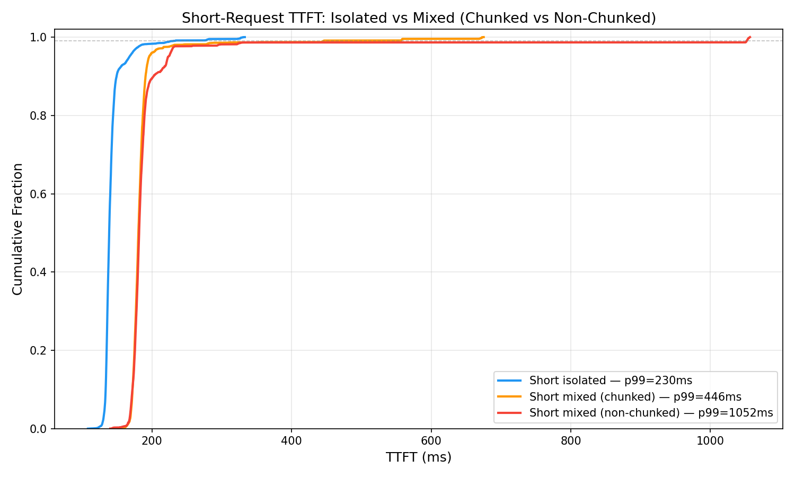
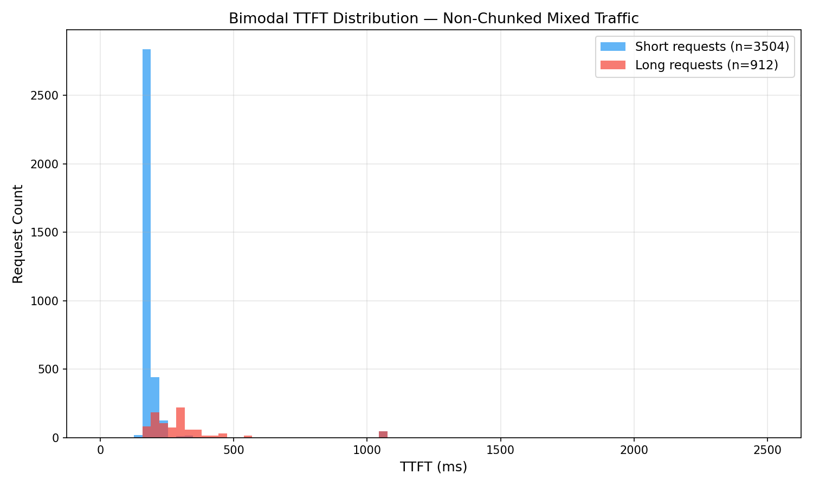
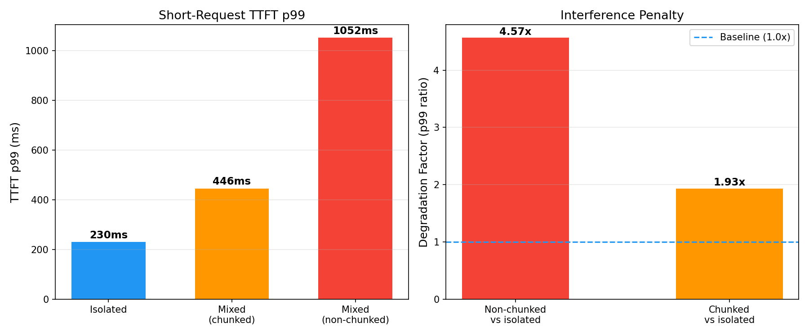

# Deliverable #6: Prefill/Decode Interference Analysis

Hardware: T4 (g4dn.xlarge) | Model: Qwen2.5-3B-Instruct | vLLM 0.17.1 (V1 engine)

---

## Section 1: The Problem

Prefill and decode are asymmetric operations that compete for the same iteration scheduling slot in vLLM's engine.

Prefill is compute-bound and bursty. It processes all N input tokens in a single forward pass (or chunked across multiple passes), running attention and FFN computations across all layers. A 2048-token prefill saturates the GPU's compute units for the duration of that iteration.

Decode is memory-bandwidth-bound and sustained. It generates one token per sequence per forward pass, reading from the KV cache. Each decode step is fast (~10ms per iteration for short requests) but must happen repeatedly.

They cannot interleave within a single forward pass. vLLM's scheduler executes one iteration at a time: every request in the batch (prefill and decode alike) waits for the iteration to complete before any can advance. When a long prefill is in the batch, its compute time determines the iteration latency for all co-scheduled requests.

Blocking quantified: using the empirical fit from Day 21 (`TTFT(ms) = 37.6 + 0.228 * prompt_tokens`), one 2048-token prefill creates a ~504ms starvation window. Every co-scheduled short request's decode step is frozen for that duration, regardless of how small or lightly loaded the short request is.

---

## Section 2: Measured Interference

### Experiment design

Four runs form a 2x2 matrix isolating two variables: presence of long requests, and chunked prefill on/off.

```
                        Chunked prefill ON       Chunked prefill OFF
Mixed traffic           Run A (Day 22)           Run C (Day 23)
Short-only              Run B (Day 22)           Run D (Day 23)
```

All runs: T4, gpu_memory_utilization=0.90, max-model-len=4096, max-num-seqs=128, 96 concurrent requests (48 short + 48 long in mixed runs), 10 minutes each. Short requests: 64 prompt tokens, 128 max_new_tokens. Long requests: 2048 prompt tokens, 512 max_new_tokens. Zero preemptions and zero queuing in all runs. KV cache utilization during these runs was 3-16%, well below the 87% cliff measured on Day 24. The interference measured here is purely a scheduling fairness problem, not a KV pressure problem.

### Results

```
                          Non-Chunked                 Chunked (default)
                          Mixed     Short-only        Mixed     Short-only
Short TTFT p50            181.5ms   138.6ms           180.4ms   135.8ms
Short TTFT p99            1051.9ms  230.4ms           445.5ms   209.5ms

Interference penalty      4.57x                       2.13x
  (p99 mixed/isolated)
```

### Dual-CDF plot



The blue curve (isolated short-only) is tight: p99 at 230ms. The red curve (non-chunked mixed) has the same steep rise for the median but a long tail to 1052ms. The orange curve (chunked mixed) sits between them, with the tail pulled back to 446ms.

The gap between curves at p99 is the measured interference penalty. Without chunking: 822ms. With chunking: 236ms.

Roughly 90% of short requests in mixed traffic have similar latency to the isolated baseline. The interference is a tail phenomenon: the unlucky 5-10% that land during a long prefill iteration absorb the full starvation window.

### Bimodal TTFT histogram



Short requests cluster at ~130-180ms. Long requests spread across 150-500ms. The short-request outliers at ~1050ms are the decode-starved requests whose prefill or early decode step coincided with a long request's full 2048-token prefill pass.

### Headline number

```
p99 degradation factor (non-chunked): 4.57x
```

Short-request p99 TTFT is 4.57x worse when co-scheduled with long-context requests under non-chunked prefill.

---

## Section 3: Chunked Prefill Results

```
Metric                              Non-Chunked     Chunked       Delta
Short-request TTFT p50 (mixed)      181.5ms         180.4ms       -0.6%
Short-request TTFT p99 (mixed)      1051.9ms        445.5ms       -57.6%
Long-request throughput (tok/s)     778.2           778.2          0%
Overall system throughput (req/s)   7.36            7.36           0%
Avg tokens per iteration            411.5           275.9         -33%
```



Chunked prefill improved short-request p99 by 57.6% at zero long-request throughput cost.

The mechanism: without chunking, a 2048-token prefill runs as a single forward pass, and each iteration averages 411 tokens. With chunking (budget=2048 tokens/iteration), the scheduler splits prefill across iterations and interleaves decode tokens, reducing average iteration size to 276 tokens. Shorter iterations mean decode requests advance more frequently.

The throughput cost was zero in this experiment because the system was lightly loaded (3-16% KV utilization). The total FLOPs for prefill are identical whether chunked or not; chunking redistributes the same work across more iterations. At low utilization there is enough slack to absorb the extra iteration overhead. At higher utilization, contention for the per-iteration token budget between prefill chunks and decode tokens would produce measurable throughput loss.

Chunked prefill is a scheduling fairness improvement, not a free throughput upgrade. It trades iteration efficiency for more even scheduling of decode steps.

---

## Section 4: Production Implications

In a multi-tenant inference platform, one tenant sending long-context requests silently degrades another tenant's short-request SLO. This failure mode is invisible in standard observability. GPU utilization reads 98.5% and healthy in both mixed and short-only workloads. Aggregate throughput is identical. The problem only surfaces in per-request-type latency distributions at the p99 level.

Standard monitoring (GPU %, memory %, aggregate throughput, average latency) will not detect this. An SRE looking at a dashboard showing 98.5% GPU utilization and stable request throughput would conclude the system is healthy while short-request p99 is 4.57x degraded.

Detection requires per-request-type TTFT percentile tracking. Specifically: TTFT p99 broken down by prompt length bucket or request class. Without this segmentation, the interference signal is diluted by the majority of requests that are unaffected.

This problem compounds with concurrency. More short requests co-scheduled against the same blocking prefill means more requests accumulate the ~504ms starvation window simultaneously. The cumulative latency damage scales with the number of short requests in the batch during a long prefill iteration. Admission control that ignores request-type composition will underestimate this effect.

---

## Section 5: Mitigations

A common misconception: continuous batching eliminates prefill blocking. It does not. Continuous batching allows new requests to join the batch between iterations, improving GPU utilization. But within each forward pass, the scheduler still executes all tokens in the batch together. A large un-chunked prefill dominates a full forward pass regardless of whether the batch membership was formed dynamically. Continuous batching improves utilization across requests; chunked prefill bounds per-iteration prefill work. They are orthogonal mechanisms.

Three mitigations, ordered from cheapest to most effective:

### 1. Queue tiering / request-length routing (gateway change only)

Route short and long requests to separate vLLM instances. The short-request pool never sees a 2048-token prefill, so it never experiences decode starvation. Implementation: a few lines of routing logic in an existing gateway, inspecting prompt length before dispatch. No vLLM config or code changes required.

Tradeoff: loses bin-packing efficiency. If the short pool is idle while the long pool is overloaded, GPUs are wasted. Requires enough traffic volume to justify the partitioning, or dynamic rebalancing between pools.

### 2. Chunked prefill (vLLM config change)

Enable chunked prefill and tune `max_num_batched_tokens` to bound per-iteration starvation. In this experiment, the default budget of 2048 reduced short p99 from 1052ms to 446ms at zero throughput cost. Smaller budgets (e.g., 512) would further reduce the starvation window per chunk at the cost of more iterations per prefill and potential throughput loss at high utilization.

Tradeoff: reduces but does not eliminate interference. Each chunk still creates a starvation window proportional to chunk size. Residual degradation of 2.13x remained in this experiment.

### 3. Disaggregated prefill/decode (architectural)

Route prefill and decode to separate GPU pools. Prefill GPUs handle compute-heavy prompt processing. Decode GPUs handle memory-bandwidth-bound token generation. They never compete for the same iteration slot, eliminating scheduling interference by design.

Tradeoff: requires infrastructure for two GPU pool types, a routing layer, and a mechanism to transfer KV cache from prefill GPUs to decode GPUs after prefill completes. This is the production-grade solution at scale.

---

## Key Numbers

```
Metric                                          Value
Short-request TTFT p99 (isolated)               230ms (chunked) / 230ms (non-chunked)
Short-request TTFT p99 (mixed, non-chunked)     1052ms
Short-request TTFT p99 (mixed, chunked)         446ms
p99 degradation factor (non-chunked)            4.57x
p99 degradation factor (chunked)                2.13x
Chunked prefill short p99 improvement           57.6%
Chunked prefill long throughput cost             0%
Decode starvation window (2048-tok prefill)      ~504ms
Avg tokens/iteration (non-chunked mixed)        411.5
Avg tokens/iteration (chunked mixed)            275.9
```
