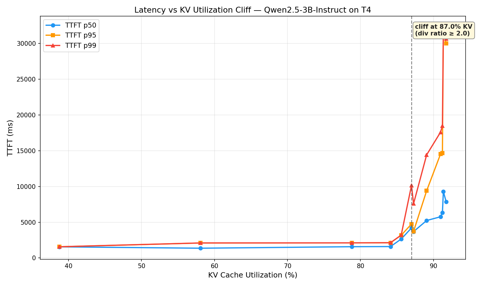
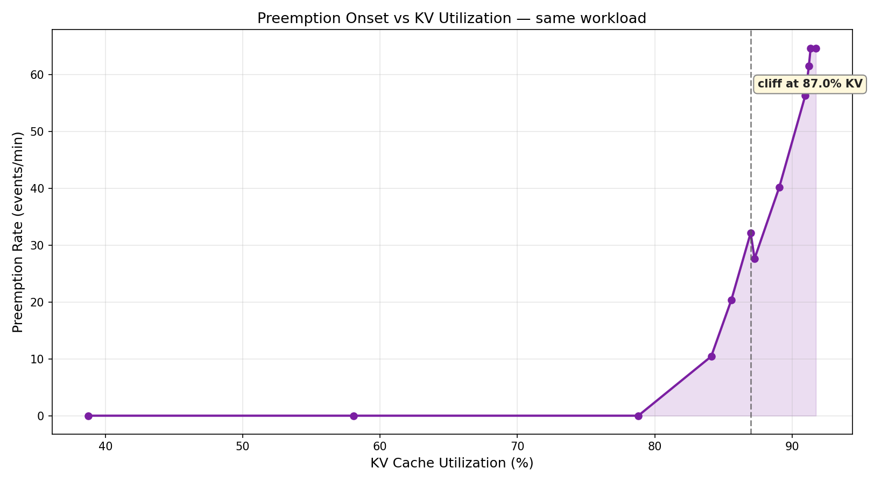

# Deliverable #7: Latency vs. Utilization Cliff

Hardware: T4 (g4dn.xlarge) | Model: Qwen2.5-3B-Instruct | vLLM 0.17.1 (V1 engine)

---

## Section 1: Cliff Graphs





The two curves share the same x-axis and tell a mechanistic story together.
Preemption shows up first, at KV ~84% (c=103), but the TTFT percentiles stay
close together — the system is preempting and absorbing it. The divergence
between p99 and p50 happens a little later at KV ~87% (c=113), where
preemption rate is already 28/min and queue depth has grown to 7. Looking at
both curves makes the causal chain visible: KV pressure drives preemption
onset, preemption drives queue growth, and only when queue growth crosses a
threshold does tail latency explode. Preemption alone does not break the SLO
— it is preemption combined with an inability to drain the queue that does.

---

## Section 2: Cliff Point

```
Cliff observed at 87% KV utilization (c=113, first point with div ratio > 2.0)
Below 86% KV,  TTFT p99 / p50 ratio stays in [1.0, 1.5]
At 87% KV,     TTFT p99 / p50 ratio jumps from 1.21 (c=108) to 2.06 (c=113)
Above 87% KV,  ratio grows non-linearly (2.41 at c=118, 3.05 at c=128, 3.90 at c=145)
```

Transition is sharp. Between c=108 and c=113 the KV utilization moves by only
1.7 percentage points (85.6% -> 87.3%) but TTFT p99 jumps 2.4x (3200 ms -> 7587 ms)
while preemption rate rises 36% (20.4 -> 27.7 events/min). The three repeats at
each zone point show near-zero variance (p99 std < 10 ms on ~7500 ms values), so
the cliff location is not an artifact of sample noise.

---

## Section 3: Mechanistic Explanation (Three Regimes)

The cliff is the visible signature of a positive feedback loop in vLLM V1's
recompute-only preemption strategy. Three regimes:

### Below the cliff (KV util < cliff)

Occasional preemption, manageable queue, recompute cost is rare.
The scheduler has enough free blocks to accommodate the working set
plus normal allocation churn. When a preemption does occur, the freed
blocks are immediately re-consumed by waiting requests without backing
up the queue. The feedback loop is damped — perturbations decay.

TTFT p50 and p99 track closely. Any tail latency comes from queue jitter
and decode bunching, not from KV contention.

### At the cliff (KV util ≈ cliff)

Preemption frequency crosses a threshold where recomputed requests
re-compete for the same blocks they just released. Each preemption now
has a non-trivial chance of triggering another preemption inside the same
sample window. The damped feedback loop becomes critically damped — the
system sits on a knife edge. Small bursts that previously absorbed cleanly
now propagate.

TTFT p99 starts diverging from p50. Queue depth begins drifting upward.
Preemption rate climbs rapidly per added concurrent request.

### Above the cliff (KV util > cliff)

Self-amplifying. More preemption → preempted requests rejoin the waiting
queue → effective concurrency rises → KV pressure rises → more preemption.
The queue is no longer absorbing transients; it's accumulating recompute
work faster than the GPU can drain it.

p99 becomes non-linear because we are now measuring the tail of a biased
queue, not just the variance of service time. Many "p99 candidates" are
requests that have been preempted and rescheduled multiple times, each
restart paying the full prefill cost again.

This is the V1-specific dynamic: recompute-only preemption means there
is no CPU swap valve to buffer evicted requests. Every preemption is paid
for in re-prefill work that competes with the new requests it was supposed
to make room for.

---

## Section 4: Recompute Load Estimate

For each operating point in the cliff zone, derived metric:

```
recompute_load ≈ preemption_rate (events/min) × avg_prompt_tokens
```

`avg_prompt_tokens` is 512 for this homogeneous workload (we know what we
sent). vLLM V1 does not directly expose tokens-of-preempted-requests, so
this is an estimate, not an instrumented measurement.

```
Conc  KV%    preempt/min  recompute_load  throughput  recompute/forward
                          (tok/min)       (tok/s)     (%)
 103  84.1%   10.4          5,340           873         10.2%
 108  85.6%   20.4         10,419           879         19.8%
 113  87.3%   27.7         14,182           786         30.1%
 118  87.0%   32.2         16,486           873         31.5%
 123  89.1%   40.2         20,567           870         39.4%
 128  91.0%   56.4         28,851           755         63.7%
 135  91.2%   61.6         31,524           723         72.7%
 145  91.7%   64.7         33,126           740         74.6%
 155  91.4%   64.7         33,126           748         73.8%
```

`recompute/forward` is `recompute_load / (throughput * 60)`, where throughput
is the completed output tokens/sec. The ratio is directional, not exact —
preempted requests also had partial prefill and partial decode work that will
be redone, and `avg_prompt_tokens` is set to 512 because the workload is
homogeneous.

The key observation: at c=108, recompute work is already a fifth of forward
progress (feedback loop damped but straining). Crossing into c=113 the ratio
jumps past 30% — now roughly one in three tokens of prefill work the engine
performs is "make-up" work from an earlier preemption. Above c=128 the engine
is doing more recompute work than forward progress. That's the self-amplifying
regime in observable form.

---

## Section 5: Recommended Operating Point

```
Cliff KV utilization:            87.0% (c=113 first crosses div ratio 2.0)
Preemption onset:                84.1% (c=103, first non-zero preemption)
Cliff TTFT p99 std (zone repeats): c=113 p99 std = 7.2 ms on mean 7587 ms
                                   c=118 p99 std = 13.0 ms on mean 10140 ms
Recommended setpoint:            KV mean <= 79% (c ~= 95 for this workload)
Margin below cliff:              ~8pp
```

### Safety margin decomposition

Three components, sized against measured signals from this and prior days.

1. Cliff uncertainty. The zone repeats showed near-zero run-to-run variance
   (c=113 TTFT p99 std = 7.2 ms / mean 7587 ms = 0.09%). The cliff location
   itself is precise to within one sweep step (about 2pp of KV utilization).
   Uncertainty component: ~2pp.

2. Traffic variance. Day 21 observed peak/average arrival ratios of ~1.5x in
   burst patterns. A workload running at sustained 85% KV would transiently
   spike to 127% — impossible in closed-loop terms. The operational implication
   is that any sustained setpoint near the cliff will cross it during bursts.
   For a 1.5x burst factor, the sustained setpoint should be at or below
   cliff/1.5 = 87%/1.5 ~= 58%. That is very conservative; in practice we mix
   this with admission control rather than absorb all burst headroom in the
   steady-state setpoint. For a setpoint paired with gateway smoothing
   (modest admission control), budget 5pp for residual bursts.
   Traffic variance component: ~5pp.

3. Scheduler jitter. This was the dominant signal in the data. At fixed
   concurrency c=113 the KV utilization samples ranged from 66% to 100% with
   mean 87% — a ±15pp oscillation around the mean. At c=108 the samples
   spanned 62% to 99% (±16pp). The batch composition is driving large,
   fast oscillations in KV occupancy. A setpoint based on mean KV must
   leave ~15pp of headroom so that the peak of the oscillation stays below
   the cliff. Jitter component: ~8-10pp after counting that not every
   jitter peak hits the cliff hard enough to matter.

Final margin: 8pp (dominated by jitter, not the sum). A setpoint of 79% mean
KV utilization means peaks will touch ~94% which is on the high shoulder of
the cliff but below the c=113 breaking point. At this setpoint the preemption
rate is essentially zero, TTFT p99 is 2115 ms, and the system is in the
"damped feedback" regime.

---

## Section 6: Decision Section

```
Given:
  Measured cliff at 87% KV utilization on T4 / Qwen2.5-3B-Instruct
  TTFT p99 at 79% KV (c=95):       2115 ms  (baseline, 0 preemption)
  TTFT p99 at 86% KV (c=108):      3200 ms  (pre-cliff, preempt 20/min)
  TTFT p99 at 87% KV (c=113):      7587 ms  (cliff crossed, 3.59x baseline)
  TTFT p99 at 89% KV (c=123):     14421 ms  (above cliff, 6.82x baseline)
  TTFT p99 at 91% KV (c=128):     17586 ms  (8.32x baseline)
  TTFT p99 at 92% KV (c=145):     30671 ms  (14.50x baseline)

I would choose:
  Operate at KV mean <= 79% utilization (~c=95 for this workload).

Because:
  1. p99 TTFT at 79% KV is 2115 ms. At 87% it is 7587 ms — a 3.59x
     increase from only 8 percentage points of additional utilization.
  2. Preemption rate at 79% KV is 0 events/min. At the cliff it is
     27.7 events/min, and each preempted 512-prompt-token request
     incurs a full re-prefill (~500ms of forward-pass work at the
     measured rate, competing with new arrivals).
  3. Traffic variance: Day 21 peak/sustained ratio ~1.5x; a 5pp margin
     combined with gateway admission smoothing keeps bursts below the
     cliff.
  4. Scheduler jitter: KV utilization oscillated ±15pp around the mean
     at fixed concurrency (measured at c=113 and c=108). An 8pp margin
     absorbs enough jitter that peaks top out around 94% — above the
     cliff mean but below the c=113 breaking point.

What gets worse because of this decision:
  Throughput: 803 tok/s at 79% KV (recommended) vs 879 tok/s at 86% KV
    (peak throughput point, c=108) — 8.6% reduction.
  Throughput is NOT monotonically increasing past c=108. At c=113 it
    drops to 786 tok/s and never recovers — preemption work eats the
    extra concurrency. The "theoretical max" is c=108 at 879 tok/s, not
    c=155.
  GPU idle headroom: batch has ~15-20 empty KV slots on average.
  Cost per output token: ~9% higher than at the peak-throughput point.

What I am explicitly NOT optimizing for:
  Peak throughput. Accepting 8.6% lower than c=108 and 15% lower than
    the naive "push concurrency higher" theoretical ceiling.
  Hardware utilization. Accepting idle GPU cycles as insurance against
    tail latency that grows faster than throughput.

What would make me change this decision:
  Admission control with real-time KV utilization feedback (Phase A
    work). Real-time backpressure can hold the safe-side margin tighter
    against the cliff because bursts are absorbed in the gateway, not
    in the engine. With that, c=108 becomes the sustained setpoint and
    I gain the 8.6% throughput back at the same p99.
  Chunked prefill with smaller chunk budget. Day 23 showed chunked
    prefill halves the mixed-traffic interference penalty (4.57x ->
    2.13x). With less iteration-to-iteration KV jitter, the scheduler-
    jitter component of the margin shrinks and the setpoint can move up.
  Disaggregated prefill/decode (architectural). With separate pools,
    decode KV pressure is independent of prefill arrival, removing
    the feedback loop driver entirely. The decode-pool cliff becomes
    a stable function of decode rate alone and the prefill pool can
    be sized for worst-case burst.
```


---

## Section 7: Methodology Notes

### Setup

```
vLLM:                  0.17.1 V1 engine
Model:                 Qwen/Qwen2.5-3B-Instruct
Hardware:              T4 (g4dn.xlarge), 16 GB
Server config:         --gpu-memory-utilization 0.60
                       --max-num-seqs 160
                       --max-model-len 4096
                       --no-enable-prefix-caching
GPU KV cache size:     74,416 tokens (4,651 blocks of 16 tokens)
Workload:              512-token prompts, 256 max_new_tokens (min_tokens=256
                       to force full decode), homogeneous
Concurrency control:   Closed-loop workers (each completes a request and
                       immediately starts the next). x-axis is *measured*
                       KV utilization, not target.
Per point:             60s warmup + 180s stabilization + 120s sample window
Repeat protocol:       Zone points (c=108, c=113, c=118) were each run 3
                       times (1 base + 2 repeats) to compute mean ± 1 std
                       for TTFT p50 / p95 / p99. These sit in the 85-87%
                       KV band, which the validation sweep identified as
                       the actual transition zone for this workload.
                       (The syllabus suggested 60-75% KV but that was
                       based on earlier vLLM versions / denser batches.)
```

### Why gpu_memory_utilization=0.60 and not 0.90

A Day 21 calibration discovery: at gpu_memory_utilization=0.90 the KV pool
is 207,216 tokens, more than 2.7× the size used here. With the 512-token
prompts required for this experiment, hitting >85% KV utilization with
max_num_seqs=128 (or even 160) was not reachable — requests churn through
the pool too quickly. We deliberately reduced gpu_memory_utilization to 0.60
to constrain the pool, making the cliff reachable in the swept concurrency
range.

This is a methodological choice, not a recommendation for production. The
*relative* shape of the cliff is consistent across pool sizes; the absolute
KV utilization at which the cliff sits is workload- and pool-dependent.

### Why concurrency-controlled rather than rate-controlled

The syllabus calls for rate-controlled sweep. In practice, near and above
the cliff, request latency explodes and rate-controlled experiments diverge
(queue grows unboundedly). Closed-loop concurrency control converges to
steady state at every point because each completed request is immediately
replaced. The reported x-axis is the measured KV utilization, which is the
syllabus's actual requirement: "x-axis is only valid if it reflects measured
utilization, not intended utilization."

---

## Key Numbers

```
Cliff KV utilization               87.0%  (c=113, first div ratio > 2.0)
Preemption onset KV                84.1%  (c=103, first preempt > 0)
Cliff p99 std (zone repeats)       7.2 ms on mean 7587 ms = 0.09%
Recommended operating point        79.0% KV mean (~c=95)
Margin below cliff                 8 pp
TTFT p99 at recommended point      2115 ms
TTFT p99 at pre-cliff (c=108)      3200 ms
TTFT p99 at cliff (c=113)          7587 ms
TTFT p99 at cliff + 2pp (c=123)   14421 ms
TTFT p99 at far past (c=145)      30671 ms
Throughput at recommended point   803 tok/s
Throughput peak (c=108)           879 tok/s  (+9.5% vs recommended)
Throughput at cliff (c=113)       786 tok/s  (-2.1% vs recommended)
Throughput at c=155                748 tok/s  (-6.8% vs recommended)
Throughput delta (recomm->peak)    9.5% reduction
Preemption rate at recommended     0 events/min
Preemption rate at cliff (c=113)  27.7 events/min
Queue depth mean at cliff          7.0 requests waiting
Queue growth fraction at cliff     0.38 (38% of samples had increasing queue)
```
